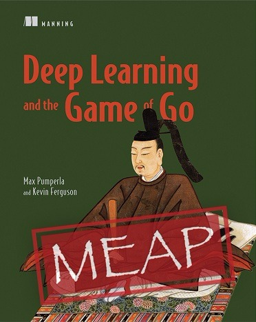

# Deep Learning and the Game of Go [](https://travis-ci.org/maxpumperla/deep_learning_and_the_game_of_go)

This repository is first and foremost a comprehensive machine learning framework for the game of Go, focussing on deep learning techniques. What you'll find here is a library that builds up from the game-play basics to very advanced techniques. In particular, you find code **for early approaches in game AI, intermediate techniques using deep learning, to implementations of AlphaGo and AlphaGo Zero - all presented in one common framework**. You can install this library with pip and follow the `examples` in the `code` folder.

```bash
pip install dlgo
```

On the other hand, this repository at the same time contains [Code](https://github.com/maxpumperla/deep_learning_and_the_game_of_go/tree/master/code), and sample chapters for the book "Deep Learning and the Game of Go" (Manning), available for early access [here](https://www.manning.com/books/deep-learning-and-the-game-of-go), which ties into the library and teaches its components bit by biy. If you're following the code samples from the book, check out the branches for
individual chapters.

*Note for contributors*: To ensure the book stays in sync, consider requesting changes and submitting pull requests against the `improvements` branch, instead of `master` (which we keep reserved for bug fixes etc.).



## Playable demos

The book is all about getting you started to create your own bots. To make the experience more fun and interactive, we built and deployed several bots showcasing the techniques of the respective chapter. So far you can play:

- **Chapter 4** A tiny tree search bot on a 5x5 board [here](https://www.badukai.com/demos/static/play_mcts_55.html).
- **Chapter 7** A full 19x19 bot powered by a deep neural network trained to predict human moves [here](https://www.badukai.com/demos/static/play_predict_19.html)
- **Chapter 9** A bot playing on a 9x9 board, using policy gradients, [here](https://www.badukai.com/demos/static/play_pg_99.html)

These demos will be available in the [liveBook](https://www.manning.com/books/deep-learning-and-the-game-of-go) version of the book as well.

<iframe src="https://www.badukai.com/demos/static/play_predict_19.html" height="500" width="800" style="border:2px solid grey; background-color: #f8f8f8;"></iframe>

## Table of Contents

1. Toward deep learning: a machine learning introduction
2. Go as a machine learning problem
3. Implementing your first Go bot
4. Playing games with tree search
5. Getting started with neural networks
6. Designing a neural network for Go data
7. Learning from data: a deep learning bot
8. Deploying bots in the wild
9. Enter deep reinforcement learning
10. Reinforcement learning with policy gradients
11. Reinforcement learning with value methods
12. Reinforcement learning with actor-critic methods
13. AlphaGo: Combining approaches
14. AlphaGoZero and AlphaZero: Combining approaches

Appendices

- A. Mathematical foundations with Python
- B. The backpropagation algorithm
- C. Go programs and servers
- D. Training and deploying bots using Amazon Web Services
- E. Submitting a bot to the Online Go Server (OGS)


## Welcome

When AlphaGo hit the news in early 2016, we were extremely excited about this groundbreaking advancement in computer Go. At the time, it was largely conjectured that human-level artificial intelligence for the game of Go was at least 10 years in the future. We followed the games meticulously and didn’t shy away from waking up early or staying up late to watch the broadcasted games live. Indeed, we had good company — millions of people around the globe were captivated by the games against Fan Hui, Lee Sedol, and later, Ke Jie and others.

Shortly after the emergence of AlphaGo, we picked up work on a little open source library we coined [BetaGo](https://github.com/maxpumperla/betago) to see if we could implement some of the core mechanisms running AlphaGo ourselves. The idea of BetaGo was to bring AlphaGo to regular developers. While we were realistic enough to accept that we didn’t have the resources (time, computing power, or intelligence) to compete with Deepmind's incredible achievement, it has been a lot of fun to create our own Go bot. Since then, we’ve had the privilege to speak about computer Go at quite a few occasions.

We strongly believe that the principles underpinning AlphaGo can be taught to a general software engineering audience in a practical manner. Enjoyment and understanding of Go comes from playing it and experimenting with it. It can be argued that the same holds true for machine learning, or any other discipline for that matter. In this book, we hope to use the game of Go as a gateway to the exciting world of deep learning. We start with the classical AI principles for board games. Right from the start, you’ll have a working Go AI that you can play against—although it will be very weak at first. Then we’ll introduce some techniques from the world of deep learning and reinforcement learning. As you learn each technique, you can incorporate it into your Go AI and watch it improve.

If you share some of our enthusiasm for either Go or machine learning, hopefully both, at the end of this book, we’ve done our job. If, on top of that, you know how to build and ship a Go bot and run your own experiments, many other interesting artificial intelligence applications will be accessible to you as well. Enjoy the ride!
